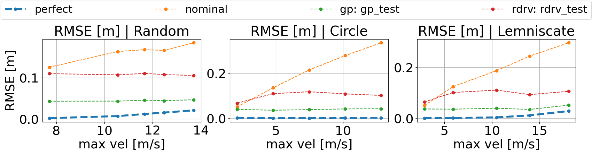

# Data-Driven MPC for Quadrotors

This repo contains the code associated to our paper Data-Driven MPC for Quadrotors. 

[](https://youtu.be/FHvDghUUQtc)

### Citing

If you use this code in an academic context, please cite the following publication:

Paper: [Data-Driven MPC for Quadrotors](http://rpg.ifi.uzh.ch/docs/RAL21_Torrente.pdf)

Video: [YouTube](https://youtu.be/FHvDghUUQtc)

```
@article{torrente2021data,
  title={Data-Driven MPC for Quadrotors},
  author={Torrente, Guillem and Kaufmann, Elia and Foehn, Philipp and Scaramuzza, Davide},
  journal={IEEE Robotics and Automation Letters},
  year={2021}
}
```

## License

Copyright (C) 2020-2021 Guillem Torrente, Elia Kaufmann, Philipp Foehn, Davide Scaramuzza, Robotics and Perception Group, University of Zurich

This is research code, expect that it changes often and any fitness for a particular purpose is disclaimed.
For a commercial license, please contact [Davide Scaramuzza](http://rpg.ifi.uzh.ch/people_scaramuzza.html).

```
This program is free software: you can redistribute it and/or modify
it under the terms of the GNU General Public License as published by
the Free Software Foundation, either version 3 of the License, or
(at your option) any later version.

This program is distributed in the hope that it will be useful,
but WITHOUT ANY WARRANTY; without even the implied warranty of
MERCHANTABILITY or FITNESS FOR A PARTICULAR PURPOSE.  See the
GNU General Public License for more details.

You should have received a copy of the GNU General Public License
along with this program.  If not, see <http://www.gnu.org/licenses/>.
```

This work depends on the ACADOS Toolkit, developed by the Optimization in Engineering Center (OPTEC) under supervision of Moritz Diehl. Licensing detail can be found on the [ACADOS github](https://github.com/acados/acados/blob/master/LICENSE). It is released under the BSD license.

## Installation

### Minimal Requirements

The code was tested with Ubuntu 18.04, Python 3.6 and ROS Melodic. 
We additionally provide python3.8 support tested with ROS Noetic in Ubuntu 20.04 in the branch `python3.8_support`.
Different OS and ROS versions are possible but not supported.

**Recommended**: Create a Python virtual environment for this package:
```
sudo pip3 install virtualenv
cd <PATH_TO_VENV_DIRECTORY>
virtualenv gp_mpc_venv --python=/usr/bin/python3.6
source gp_mpc_venv/bin/activate
```

**Installation of `acados` and its Python interface** : 
- Build and install the Acados C library. Please follow their [installation guide](https://docs.acados.org/installation/index.html). 
- Install the Python interface. Steps also provided in the [Python interface wiki](https://docs.acados.org/interfaces/index.html#installation).

### Additional Requirements

The code that runs on the `Gazebo Simulation` environment builds on `rpg_quadrotor_control`. You may skip this step if intending to use only the `Simplified Simulation`. <br/>
Otherwise, create a catkin workspace following these [installation instructions](https://github.com/uzh-rpg/rpg_quadrotor_control/wiki/Installation-Guide). <br/>
After these steps you should have all the ROS packages required to run the RPG Quadrotor simulation also in the `Gazebo Simulation`.


### Initial setup

0. Source Python virtual environment if created.
   ```
   source <path_to_gp_mpc_venv>/bin/activate
   ```

1. Clone this repository into your catkin workspace.
   ```
   cd <CATKIN_WS_DIR>
   git clone https://github.com/uzh-rpg/data_driven_mpc.git
   ```
   
2. Install the rest of required Python libraries:
   ```
   cd data_driven_mpc
   python setup.py install
   ```
 
3. Build the catkin workspace:
   ```
   cd <CATKIN_WS_DIR>
   catkin build
   source devel/setup.bash
   ```

## Running the package in Simulation
We provide instructions of how to use this package in two different simulators. In the paper we call them `Simplified Simulation` and `Gazebo Simulation`. While the `Simplified Simulation` is a lightweight Python simulator, the `Gazebo Simulation` builds on the well-known [RotorS extension](https://github.com/ethz-asl/rotors_simulator).

First make sure to add to your Python path the main directory of this package. Also activate the virtual environment if created.
```
export PYTHONPATH=$PYTHONPATH:<CATKIN_WS_DIR>/src/data_driven_mpc/ros_gp_mpc
```

### First steps
To verify the correct installation of the package, execute first a test flight on the `Simplified Simulation`.
```
roscd ros_gp_mpc
python src/experiments/trajectory_test.py
```

After the simulation finishes, a correct installation should produce a result very similar to the following (`Mean optinization time` may vary).
```
:::::::::::::: SIMULATION SETUP ::::::::::::::

Simulation: Applied disturbances: 
{"noisy": true, "drag": true, "payload": false, "motor_noise": true}

Model: No regression model loaded

Reference: Executed trajectory `loop` with a peak axial velocity of 8 m/s, and a maximum speed of 8.273 m/s

::::::::::::: SIMULATION RESULTS :::::::::::::

Mean optimization time: 1.488 ms
Tracking RMSE: 0.2410 m
```

#### Further details
You may edit the configuration variables for the `Simplified Simulator` in the file `config/configuration_parameters.py` for better visualization.
Within the class `SimpleSimConfig`:
```
# Set to True to show a real-time Matplotlib animation of the experiments for the Simplified Simulator. Execution 
# will be slower if the GUI is turned on. Note: setting to True may require some further library installation work.
custom_sim_gui = True

# Set to True to display a plot describing the trajectory tracking results after the execution.
result_plots = True
```

Also, note that in this configuration file the disturbance settings of the `Simplified Simulation` are defined. 
Setting all of them to `False` reproduces the *Ideal* (as we call in our paper) scenario where the MPC has perfect knowledge of the quadrotor dynamics, and therefore will yield a much lower tracking error:
```
# Choice of disturbances modeled in our Simplified Simulator. For more details about the parameters used refer to 
# the script: src/quad_mpc/quad_3d.py.
simulation_disturbances = {
    "noisy": True,                       # Thrust and torque gaussian noises
    "drag": True,                        # 2nd order polynomial aerodynamic drag effect
    "payload": False,                    # Payload force in the Z axis
    "motor_noise": True                  # Asymmetric voltage noise in the motors
}
```

You may also vary the peak velocity and acceleration of the reference trajectory, or use the `lemniscate` trajectory instead of the `circle (loop)` one. All of these options can be specified in the script arguments. Further information can be displayed by typing: 
```
python src/experiments/trajectory_test.py --help
```

### Model Fitting Tutorial

Next, we collect a dataset for fitting GP and RDRv models in the `Simplified Simulator`. This procedure will be very similar for the `Gazebo Simulator` (explained later).

#### Data collection

First, run the following script to collect a few minutes of flight samples.
```
python src/experiments/point_tracking_and_record.py --recording --dataset_name simplified_sim_dataset --simulation_time 300
```
After the simulation ends, you can verify that the collected data now appears at the directory `ros_gp_mpc/data/simplified_sim_dataset`. We can use this data to fit our regression models.

#### Fitting a GP model

First, edit the following variables of configuration file in `config/configuration_parameters.py` (class `ModelFitConfig`) so that the training script is referenced to the desired dataset. For redundancy, in order to identify the correct data file, we require to specify both the name of the dataset as well as the parameters used while acquiring the data.
In other words, you must input the simulator options used while running the previous python script. If you did not modify these variables earlier, you don't need to change anything this time as the default setting will work:
```
    # ## Dataset loading ## #
    ds_name = "simplified_sim_dataset"
    ds_metadata = {
        "noisy": True,
        "drag": True,
        "payload": False,
        "motor_noise": True
    }
```

In our approach, we train 3 independent GP's for every velocity dimension `v_x, v_y, v_z`, so we run three times the GP training script. To indicate that the model must map `v_x` to acceleration correction `a_x` (and similarly with `y` and `z`), run the following commands. Indices `7,8,9` correspond to `v_x, v_y, v_z` respectively in our data structures. The arguments `--x` and `--y` are used to specify the `X` and `Y` variables of the regression problem. 
We assign a name to the model for future referencing, e.g.: `simple_sim_gp`:
```
python src/model_fitting/gp_fitting.py --n_points 20 --model_name simple_sim_gp --x 7 --y 7
python src/model_fitting/gp_fitting.py --n_points 20 --model_name simple_sim_gp --x 8 --y 8
python src/model_fitting/gp_fitting.py --n_points 20 --model_name simple_sim_gp --x 9 --y 9
```
The models will be saved under the directory `ros_gp_mpc/results/model_fitting/<git_hash>/`. 

You can visualize the performance of the combined three models using the visualization script. Make sure to input the correct model version (git hash) and model name.
```
python src/model_fitting/gp_visualization.py --model_name simple_sim_gp --model_version <git_hash>
```

#### Fitting an RDRv model

Similarly, we train the RDRv model with the following one-line command. This script trains all three dimensions simultaneously and provides a plot of the fitting result. The model is similarly saved under the directory `ros_gp_mpc/results/model_fitting/<git_hash>/` with the given name (e.g.: `simple_sim_rdrv`). 
```
python src/model_fitting/rdrv_fitting.py --model_name simple_sim_rdrv --x 7 8 9
```

### Model comparison experiment

To compare the trained models, we provide an automatic script for the `Simplified Simulation`. Running the following command will compare the specified models with the "Ideal" and the "Nominal" scenarios by default, and produce several results plots in the directory: `results/images/`. Using the `--fast` argument will run the script faster with less velocity samples.

```
python src/experiments/comparative_experiment.py --model_version <git_hash_1 git_hash_2 ...> --model_name <name_1 name_2 ...> --model_type <type_1 type_2> --fast
```
For example:
```
python src/experiments/comparative_experiment.py --model_version 42b8650b 42b8650b --model_name simple_sim_gp simple_sim_rdrv --model_type gp rdrv --fast
```

<p align="center">
  
</p>


## Gazebo simulator

In this section, we demonstrate how to use our repository on the `Gazebo Simulator`.

### Preparing the simulation environment

First, follow the installation guide for the [rpg_quadrotor_package](https://github.com/uzh-rpg/rpg_quadrotor_control/wiki/Installation-Guide) if you didn't do it previously.

Then, run an empty world simulation, and enable the command override function. 
Due to the increased computational demand of running the Gazebo simulator in parallel to the controller, the following launchfile runs the gazebo simulator at 50% speed:
```
roslaunch ros_gp_mpc quadrotor_empty_world.launch enable_command_feedthrough:=True
```

Finally, click `Connect` and `Arm Bridge` on the RPG Quadrotor GUI.

### Dataset recording, model fitting & evaluation in Gazebo

Run the following script to execute several random trajectories on the `Gazebo Simulator` and compile a dataset of the measured errors.

```
roslaunch ros_gp_mpc gp_mpc_wrapper.launch recording:=True dataset_name:=gazebo_dataset environment:=gazebo flight_mode:=random n_seeds:=10
```

Leave the script running until it outputs the following message: 
```
[INFO] [1612101145.957326, 230.510000]: No more references will be received
```

Update the `ModelFitConfig` class from `config/configuration_parameters.py` file to point the training scripts to the new dataset:
```
# ## Dataset loading ## #
ds_name = "gazebo_dataset"
ds_metadata = {
    "gazebo": "default",
}
```

Train a new GP (or RDRv) model as before:
```
python src/model_fitting/gp_fitting.py --n_points 20 --model_name gazebo_sim_gp --x 7 --y 7
python src/model_fitting/gp_fitting.py --n_points 20 --model_name gazebo_sim_gp --x 8 --y 8
python src/model_fitting/gp_fitting.py --n_points 20 --model_name gazebo_sim_gp --x 9 --y 9
```

We don't provide an automatic script to compare models in the Gazebo environment. However, you can do it manually by following the next steps:

#### Run a Circle trajectory without correction:

Run the following launch file. Set `plot:=True` for displaying a plot of the trajectory that will be executed beforehand, and the tracking performance after finishing the run.
Close the plot and the tracking will start automatically:
```
roslaunch ros_gp_mpc gp_mpc_wrapper.launch environment:=gazebo flight_mode:=loop plot:=True
```

Should result in an a verage tracking error of 0.2m when the maximum reference axial velocity is 10 m/s. Note that the drone does not reach this velocity because of the aerodynamic effects modeled in Gazebo:
```
[INFO] [1607523334.300131, 925.860000]: Tracking complete. Total RMSE: 0.20400 m. Max axial vel: 9.415. Mean optimization time: 7.938 ms
```

#### Run a Circle trajectory with correction

```
roslaunch ros_gp_mpc gp_mpc_wrapper.launch environment:=gazebo flight_mode:=loop plot:=True model_version:=<git_hash> model_name:=gazebo_sim_gp model_type:=gp
```

Will improve the tracking performance by around 50%, resulting in an average tracking error of `0.1m` at the same speed:
```
[INFO] [1607523961.356929, 1239.280000]: Tracking complete. Total RMSE: 0.09487 m. Max axial vel: 9.714. Mean optimization time: 11.019 ms
```

#### Final notes
- **Trajectory types**

   The user can also run a `lemniscate` trajectory by setting: `flight_mode:=lemniscate`.
   It is also possible to edit the reference trajectories of the circle and lemniscate by modifying the file:
   `config/circle_and_lemniscate_options.yaml`
  

- **Thrust level control** 
  
   Even though the MPC model operates at thrust level control, currently the ROS node sends total thrust + body rate 
   commands. To switch to single thrust level control, edit the following line [from the MPC ros interface file](ros_gp_mpc/src/quad_mpc/create_ros_gp_mpc.py):
  
   From (body rate control):
   ```
   next_control.control_mode = 2
   ```
   Instead switch to (thrust level control):
   ```
   next_control.control_mode = 4
   ```
